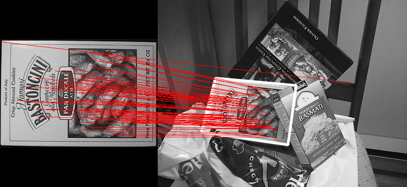

### 基于SIFT实现图像拼接（A look into the past）

成员及分工

1. 沈蜀媛 PB18111756

   调研、设计、coding、实验报告

2. 高凤舆 PB18111728

   调研、设计、coding、实验报告

#### 问题描述

在日常生活中，我们经常使用 PS 等软件进行 P 图，在学习完计算机视觉这门课程后，我们意识到我们可以使用学习的专业知识实现一些 P 图软件的功能。经过调研，我们小组对于图片拼接方面有比较浓厚的兴趣，我们希望，能将多张图片拼接在一起，使得图片显现“昨日重现”的效果。

于是，我们小组利用 NumPy库函数使用 Python 实现了SIFT（David G. Lowe's scale-invariant feature transform）。并利用 SIFT 完成了图像拼接任务，实现了“昨日重现”。

上述创意的实现，可以转化为计算机视觉的图像拼接问题，关键技术是关键点检测、匹配和图像的缝合。

#### 原理分析

##### SIFT 特征点提取

计算机视觉中的特征点提取算法比较多，但SIFT除了计算比较耗时以外，其他方面的优点让其成为特征点提取算法中的一颗璀璨的明珠。

尺度不变特征转换，即 SIFT (Scale-invariant feature transform)是一种计算机视觉的算法。它用来侦测与描述影像中的局部性特征，它在空间尺度中寻找极值点，并提取出其位置、尺度、旋转不变量，此算法由 David Lowe在1999年所发表，2004年完善总结。

其应用范围包含物体辨识、机器人地图感知与导航、影像缝合、3D模型建立、手势辨识、影像追踪和动作比对。

局部影像特征的描述与侦测可以帮助辨识物体，SIFT特征是基于物体上的一些局部外观的兴趣点而与影像的大小和旋转无关。对于光线、噪声、些微视角改变的容忍度也相当高。基于这些特性，它们是高度显著而且相对容易撷取，在母数庞大的特征数据库中，很容易辨识物体而且鲜有误认。使用 SIFT特征描述对于部分物体遮蔽的侦测率也相当高，甚至只需要3个以上的SIFT物体特征就足以计算出位置与方位。在现今的电脑硬件速度下和小型的特征数据库条件下，辨识速度可接近即时运算。SIFT特征的信息量大，适合在海量数据库中快速准确匹配。

SIFT算法的实质是在不同的尺度空间上查找关键点(特征点)，并计算出关键点的方向。SIFT所查找到的关键点是一些十分突出，不会因光照，仿射变换和噪音等因素而变化的点，如角点、边缘点、暗区的亮点及亮区的暗点等。

算法流程如下：

输入灰度图像，得到图像金字塔，进而得到特征点主方向和图像差分金字塔。在图像差分金字塔中进行极值检测以及定位。进一步可以得到特征描述子，最终获得图像所有特征描述向量。

#### 代码实现

图像拼接用的方法是用 SIFT 算法将两张图片找到合适的拼接点，代码分析如下：

1. 所调用的包：

```python
import numpy as np
import cv2
import pysift
from matplotlib import pyplot as plt
import logging
```

2. 读入数据：

```python
img1 = cv2.imread('box.png', 0)     
img2 = cv2.imread('box_in_scene.png', 0)  
```

3. 特征点计算以及特征点描述

```python
# 计算特征点以及描述
kp1, des1 = pysift.computeKeypointsAndDescriptors(img1)
kp2, des2 = pysift.computeKeypointsAndDescriptors(img2)
```

下面介绍我们实现 SIFT 算法的过程，代码如下：

主要函数：ComputeKeypointandDescriptors 函数，调用其他子函数来计算特征点以及特征点描述

```python
def computeKeypointsAndDescriptors(image, sigma=1.6, num_intervals=3, assumed_blur=0.5, image_border_width=5):
    """Compute SIFT keypoints and descriptors for an input image
    """
    image = image.astype('float32')
    base_image = generateBaseImage(image, sigma, assumed_blur)
    num_octaves = computeNumberOfOctaves(base_image.shape)
    gaussian_kernels = generateGaussianKernels(sigma, num_intervals)
    gaussian_images = generateGaussianImages(base_image, num_octaves, gaussian_kernels)
    dog_images = generateDoGImages(gaussian_images)
    keypoints = findScaleSpaceExtrema(gaussian_images, dog_images, num_intervals, sigma, image_border_width)
    keypoints = removeDuplicateKeypoints(keypoints)
    keypoints = convertKeypointsToInputImageSize(keypoints)
    descriptors = generateDescriptors(keypoints, gaussian_images)
    return keypoints, descriptors
```

其中调用的子函数具体实现详见 pysift.py。

4. 初始化并使用FLANN

   ```python
   	 # Initialize and use FLANN
      FLANN_INDEX_KDTREE = 0
      index_params = dict(algorithm = FLANN_INDEX_KDTREE, trees = 5)
      search_params = dict(checks = 50)
      flann = cv2.FlannBasedMatcher(index_params, search_params)
      matches = flann.knnMatch(des1, des2, k=2)
   ```

5. Lowe's 算法

   ```python
      good = []
      for m, n in matches:
          if m.distance < 0.7 * n.distance:
              good.append(m)
      
      #画出各个匹配的点连成线
      if len(good) > MIN_MATCH_COUNT:
          # Estimate homography between template and scene
          src_pts = np.float32([ kp1[m.queryIdx].pt for m in good]).reshape(-1, 1, 2)
          dst_pts = np.float32([ kp2[m.trainIdx].pt for m in good]).reshape(-1, 1, 2)
      
          M = cv2.findHomography(src_pts, dst_pts, cv2.RANSAC, 5.0)[0]
      
          # Draw detected template in scene image
          h, w = img1.shape
          pts = np.float32([[0, 0],
                            [0, h - 1],
                            [w - 1, h - 1],
                            [w - 1, 0]]).reshape(-1, 1, 2)
          dst = cv2.perspectiveTransform(pts, M)
      
          img2 = cv2.polylines(img2, [np.int32(dst)], True, 255, 3, cv2.LINE_AA)
      
          h1, w1 = img1.shape
          h2, w2 = img2.shape
          nWidth = w1 + w2
          nHeight = max(h1, h2)
          hdif = int((h2 - h1) / 2)
          newimg = np.zeros((nHeight, nWidth, 3), np.uint8)
      
          for i in range(3):
              newimg[hdif:hdif + h1, :w1, i] = img1
              newimg[:h2, w1:w1 + w2, i] = img2
      
          # Draw SIFT keypoint matches
          for m in good:
              pt1 = (int(kp1[m.queryIdx].pt[0]), int(kp1[m.queryIdx].pt[1] + hdif))
              pt2 = (int(kp2[m.trainIdx].pt[0] + w1), int(kp2[m.trainIdx].pt[1]))
              cv2.line(newimg, pt1, pt2, (255, 0, 0))
      
          plt.imshow(newimg)
          plt.show()
      else:
          print("Not enough matches are found - %d/%d" % (len(good), MIN_MATCH_COUNT))
   
   ```

#### 效果展示



#### 工程结构

```
.
├── README.md
├── box.png
├── box_in_scene.png
├── result.png
├── pysift.py
└── main.py
```

#### 运行说明

依赖环境和库

```python
Python 3.8.5
NumPy 1.19.4
OpenCV-Python 4.3.0
```

运行代码

```python
pip install opencv-python
python main.py
```


#### 参考文献

["Distinctive Image Features from Scale-Invariant Keypoints", David G. Lowe](https://www.cs.ubc.ca/~lowe/papers/ijcv04.pdf)

[Implementing SIFT in Python: A Complete Guide (Part 1)](https://medium.com/@russmislam/implementing-sift-in-python-a-complete-guide-part-1-306a99b50aa5)

[Implementing SIFT in Python: A Complete Guide (Part 2)](https://medium.com/@russmislam/implementing-sift-in-python-a-complete-guide-part-2-c4350274be2b)

